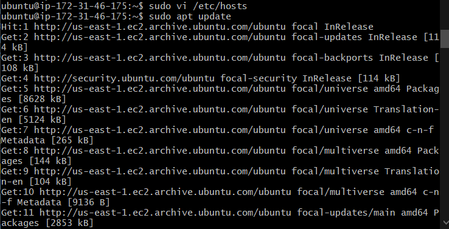

# LOAD BALANCER SOLUTION WITH NGINX AND SSL/TLS
# CONFIGURE NGINX AS A LOAD BALANCER

### 1. Create an EC2 VM based on Ubuntu Server 20.04 LTS and name it Nginx LB (do not forget to open TCP port 80 for HTTP connections, also open TCP port 443 – this port is used for secured HTTPS connections)
### 2. Update /etc/hosts file for local DNS with Web Servers’ names (e.g. Web1 and Web2) and their local IP addresses

`sudo vi /etc/hosts`

```
# Add 2 records into this file with Local IP address and arbitrary name for both of your Web Servers

172.31.40.83 Web1
172.31.37.7 Web2
```

### 3. Install and configure Nginx as a load balancer to point traffic to the resolvable DNS names of the webservers

### Update the instance and Install Nginx

```
sudo apt update
sudo apt install nginx
```




### Configure Nginx LB using Web Servers’ names defined in /etc/hosts

### Open the default nginx configuration file

`sudo vi /etc/nginx/nginx.conf`

```
#insert following configuration into http section

 upstream myproject {
    server Web1 weight=5;
    server Web2 weight=5;
  }

server {
    listen 80;
    server_name www.domain.com;
    location / {
      proxy_pass http://myproject;
    }
  }

#comment out this line
#       include /etc/nginx/sites-enabled/*;
```

### Restart Nginx and make sure the service is up and running

```
sudo systemctl restart nginx
sudo systemctl status nginx
```


# REGISTER A NEW DOMAIN NAME AND CONFIGURE SECURED CONNECTION USING SSL/TLS CERTIFICATES

### Let us make necessary configurations to make connections to our Tooling Web Solution secured!

### In order to get a valid SSL certificate – you need to register a new domain name, you can do it using any Domain name registrar – a company that manages reservation of domain names. The most popular ones are: Godaddy.com, Domain.com, Bluehost.com

### 1. Register a new domain name with any registrar of your choice in any domain zone (e.g. .com, .net, .org, .edu, .info, .xyz or any other)

### 2. Assign an Elastic IP to your Nginx LB server and associate your domain name with this Elastic IP


### 3. Update A record in your registrar to point to Nginx LB using Elastic IP address


### Check that your Web Servers can be reached from your browser using new domain name using HTTP protocol – http://<your-domain-name.com>


### 4. Configure Nginx to recognize your new domain name

### Update your nginx.conf with server_name www.<your-domain-name.com> instead of server_name www.domain.com

### 5. Install certbot and request for an SSL/TLS certificate

### Make sure snapd service is active and running

`sudo systemctl status snapd`


### Install certbot

`sudo snap install --classic certbot`


### Request your certificate (just follow the certbot instructions – you will need to choose which domain you want your certificate to be issued for, domain name will be looked up from nginx.conf file so make sure you have updated it on step 4).

```
sudo ln -s /snap/bin/certbot /usr/bin/certbot
sudo certbot --nginx
```


### Test secured access to your Web Solution by trying to reach https://<your-domain-name.com>


## I will be able to access your website by using HTTPS protocol (that uses TCP port 443) and see a padlock pictogram in my browser’s search string.

## Clicking the padlock icon will display the details of the certificate issued for my website.   


### 6.Set up periodical renewal of your SSL/TLS certificate

### By default, LetsEncrypt certificate is valid for 90 days, so it is recommended to renew it at least every 60 days or more frequently.

### I can test renewal command in dry-run mode

`sudo certbot renew --dry-run`


### Best practice is to have a scheduled job that to run renew command periodically. Let us configure a cronjob to run the command twice a day.

### To do so, lets edit the crontab file with the following command:

`crontab -e`


### Adding following line:

`* */12 * * *   root /usr/bin/certbot renew > /dev/null 2>&1`

### I can always change the interval of this cronjob if twice a day is too often by adjusting schedule expression.

# Success!

### I have just implemented an Nginx Load Balancing Web Solution with secured HTTPS connection with periodically updated SSL/TLS certificates.


